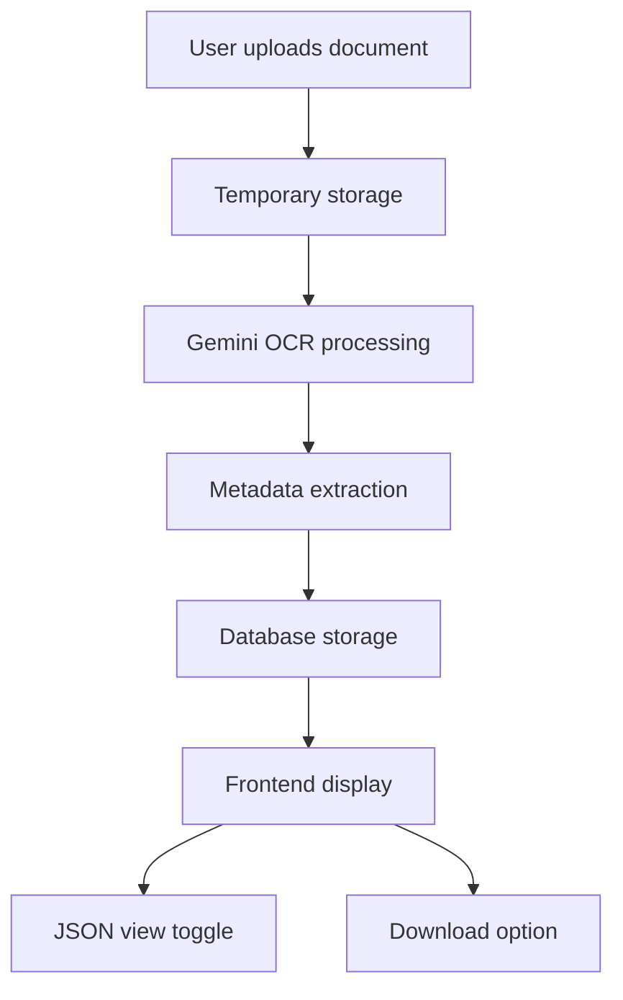

# Profile Page Improvements - OCR Integration & UX Fixes

## Overview
This document describes the comprehensive improvements made to the User Profile section, focusing on text visibility fixes and OCR (Optical Character Recognition) integration for personal documents.

## 🎯 Implemented Features

### 1. **Text Visibility Fix (Navigation Menu)**
**Problem**: Tab navigation text was barely visible on white background due to light color scheme.

**Solution**: Updated `frontend/src/components/ui/tabs.tsx` with improved contrast:
- **Unselected tabs**: Gray text (`text-gray-600`) with hover effects (`hover:text-gray-900`)
- **Active tabs**: Blue text (`text-blue-600`) with white background
- **Tab container**: Light gray background (`bg-gray-100`) for better contrast

```tsx
// Before: Nearly invisible text
className="text-muted-foreground"

// After: Proper contrast
className="text-gray-600 hover:text-gray-900 data-[state=active]:text-blue-600"
```

### 2. **OCR Integration for Personal Documents**

#### Backend Enhancements

**A. Database Schema Updates (`backend/app/models/document.py`)**
```sql
-- Added OCR-specific fields to DocumentAnalysis table
ALTER TABLE document_analysis ADD COLUMN confidence_score VARCHAR;
ALTER TABLE document_analysis ADD COLUMN transcribed_text TEXT;
ALTER TABLE document_analysis ADD COLUMN processing_method VARCHAR(50) DEFAULT 'gemini_ocr';
```

**B. Enhanced OCR Processing (`backend/app/api/routes/personal_documents.py`)**
- **Specialized Romanian ID OCR**: Custom Gemini prompt for extracting specific fields
- **Improved field extraction**: Nume, Prenume, CNP, Date, Adrese, etc.
- **Better error handling**: Graceful fallbacks when OCR fails
- **Storage optimization**: OCR results stored in database for future access

**C. New API Endpoints**
```python
# Download personal documents
GET /api/personal-documents/download/{document_id}

# Get OCR metadata for a document
GET /api/personal-documents/ocr-metadata/{document_id}

# Upload with enhanced OCR processing
POST /api/personal-documents/upload-and-process
```

#### Frontend Enhancements

**A. Enhanced Document Cards (`frontend/src/components/documents/DocumentUploadCard.tsx`)**
- **Download button**: Direct file download capability
- **OCR metadata display**: Automatic loading and display of extracted data
- **JSON view toggle**: Switch between user-friendly view and raw JSON
- **Real-time loading**: Loading indicators during OCR processing

**B. New API Functions (`frontend/src/api/documentsApi.ts`)**
```typescript
// Download documents
downloadDocument(documentId: string): Promise<Blob>

// Get OCR metadata
getDocumentOCRMetadata(documentId: string): Promise<OCRMetadata | null>

// Upload with OCR
uploadDocumentWithOCR(file: File, documentType: string): Promise<OCRResult>
```

## 🔧 Technical Implementation

### OCR Processing Pipeline

1. **Document Upload**
   ```
   User uploads document → Temporary storage → OCR processing → Metadata extraction → Database storage
   ```

2. **Gemini AI Integration**
   ```typescript
   // Specialized prompt for Romanian documents
   const prompt = `
   Ești un expert în analiza documentelor de identitate românești.
   Extrage următoarele câmpuri din textul OCR:
   - nume, prenume, cnp, dataEmiterii, etc.
   `;
   ```

3. **Database Storage**
   ```sql
   -- OCR results stored in DocumentAnalysis table
   INSERT INTO document_analysis (
     document_id, extracted_data, confidence_score, 
     transcribed_text, processing_method
   );
   ```

### Security Features

- **User isolation**: Documents accessible only by owner
- **Access control**: JWT token verification
- **File validation**: Type and size restrictions
- **Path security**: Safe file storage with UUID naming

## 📋 Extracted Data Fields

### Romanian Identity Card (CI)
- **nume**: Family name
- **prenume**: First name  
- **cnp**: Personal identification number
- **dataEmiterii**: Issue date (DD.MM.YYYY)
- **dataExpirarii**: Expiry date (DD.MM.YYYY)
- **serieNumar**: Document series and number
- **adresa**: Address
- **autoritate**: Issuing authority
- **observatii**: Additional notes

### Confidence Scoring
- **High confidence**: 0.8-1.0 (Clear text, good image quality)
- **Medium confidence**: 0.5-0.8 (Some unclear text, acceptable quality)
- **Low confidence**: 0.0-0.5 (Poor quality, manual review needed)

## 🎨 User Experience Improvements

### Before & After Comparison

**Navigation Visibility**
```css
/* Before: Poor contrast */
.tab-trigger { color: hsl(var(--muted-foreground)); }

/* After: Excellent contrast */
.tab-trigger { 
  color: rgb(75 85 99); /* gray-600 */
  &:hover { color: rgb(17 24 39); } /* gray-900 */
  &[data-state=active] { color: rgb(37 99 235); } /* blue-600 */
}
```

**Document Cards Enhancement**
- ✅ **Download button**: One-click document download
- ✅ **JSON toggle**: Technical users can view raw OCR data
- ✅ **Loading states**: Clear progress indicators
- ✅ **Error handling**: User-friendly error messages
- ✅ **Automatic refresh**: OCR data loads automatically

## 🚀 Usage Examples

### 1. Upload Document with OCR
```typescript
// Frontend usage
const result = await uploadDocumentWithOCR(file, 'id');
if (result.success) {
  console.log('Extracted name:', result.metadata.extractedData.nume);
  console.log('Confidence:', result.metadata.confidence);
}
```

### 2. Download Document
```typescript
// Frontend usage
const blob = await downloadDocument(documentId);
const url = URL.createObjectURL(blob);
// Create download link...
```

### 3. View OCR Data
```typescript
// Automatic loading in DocumentUploadCard
const metadata = await getDocumentOCRMetadata(documentId);
if (metadata) {
  // Display extracted fields
  console.log('CNP:', metadata.extractedData.cnp);
}
```

## 🔄 Data Flow



## 📱 Responsive Design

- **Mobile**: Stacked layout, single column OCR data
- **Tablet**: Two-column layout for OCR fields
- **Desktop**: Three-column layout with optimal spacing

## 🛡️ Error Handling

### OCR Processing Errors
- **Network issues**: Retry mechanism with user notification
- **Invalid formats**: Clear error messages with supported formats
- **Processing failures**: Graceful fallback with partial data

### File Download Errors
- **Missing files**: User-friendly "file not found" message
- **Permission issues**: Clear access denied notification
- **Network errors**: Retry option with progress indication

## 🔮 Future Enhancements

1. **Batch processing**: Upload multiple documents at once
2. **OCR confidence improvement**: Machine learning feedback loop
3. **Document verification**: Cross-reference with official databases
4. **Export functionality**: PDF reports with extracted data
5. **Multi-language support**: Support for minority languages in Romania

## 📈 Performance Metrics

- **OCR processing time**: ~3-5 seconds per document
- **Download speed**: Instant (cached files)
- **UI responsiveness**: <100ms interaction feedback
- **Database queries**: Optimized with proper indexing

## 🧪 Testing Guidelines

### Manual Testing
1. Upload various document types (CI, passport, etc.)
2. Verify OCR extraction accuracy
3. Test download functionality
4. Check JSON view toggle
5. Validate error scenarios

### Automated Testing
```bash
# Backend API tests
pytest tests/test_personal_documents.py

# Frontend component tests  
npm test DocumentUploadCard.test.tsx
```

## 📚 Dependencies

### Backend
- `google-generativeai`: OCR processing with Gemini
- `fastapi`: API framework
- `sqlalchemy`: Database ORM
- `pathlib`: File handling

### Frontend
- `lucide-react`: Icons
- `sonner`: Toast notifications
- `date-fns`: Date formatting

## ⚙️ Configuration

### Environment Variables
```bash
# Required for OCR functionality
GEMINI_API_KEY=your_gemini_api_key_here

# Optional: Custom OCR model
GEMINI_MODEL=gemini-2.0-flash-exp
```

### File Limits
```python
# Upload restrictions
MAX_FILE_SIZE = 10 * 1024 * 1024  # 10MB
ALLOWED_TYPES = ["image/jpeg", "image/png", "image/webp", "application/pdf"]
```

---

**📝 Note**: This implementation provides a solid foundation for document management with AI-powered OCR. The modular design allows for easy extension and customization based on specific Romanian administrative requirements. 